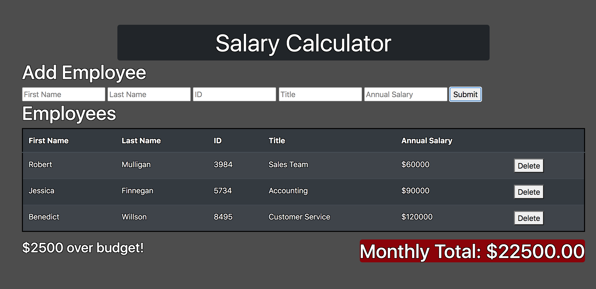

# Project Name

Jquery Salary Calculator

## Description

This is a salary calculator with inputs for employee first and last names, ID number, title, and annual salary. 
The application takes in these values and stores them in a table, where you can add or remove employees at will.

The app also calculates monthly salary costs and displays them below the table. If the monthly costs exceed
$20,000, it will display how much the budget is exceeded.

Prerequisites
This app will run on any basic browser.

Acknowledgement
Thanks to Prime Digital Academy who equipped and helped me to make this application a reality.

Support
If you have suggestions or issues, please email me at paulbuysse001@gmail.com
